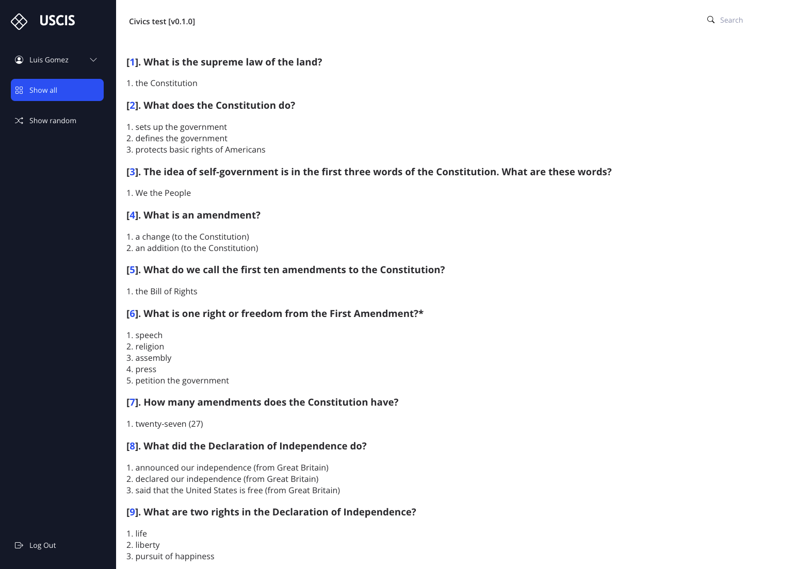

# USCIS | Civics test

Web app to help me study for the USCIS civics test.

## Screenshots

## Contributing

1. Fork it (<https://github.com/xtokio/uscis/fork>)
2. Create your feature branch (`git checkout -b my-new-feature`)
3. Commit your changes (`git commit -am 'Add some feature'`)
4. Push to the branch (`git push origin my-new-feature`)
5. Create a new Pull Request

## Contributors

- [Luis Gomez](https://github.com/xtokio) - creator and maintainer
